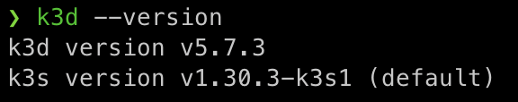
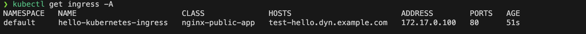
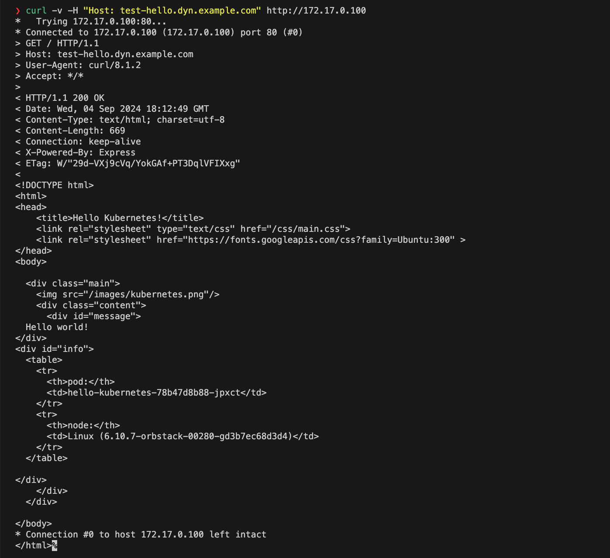

**Social:**

# [](https://k3d.io/)

## Install K3d on MacOS
<div align="center">
Install local k8s cluster with:
</div>

- k3d
- calico cni
- metallb
- nginx-ingress-controller

## Requirement
- [homebrew](https://brew.sh)
  - Install Homebrew:
```
/bin/bash -c "$(curl -fsSL https://raw.githubusercontent.com/Homebrew/install/HEAD/install.sh)"
```
- [docker](https://docs.docker.com/install/)
  - Note: Install docker-desktop
- [orbstack](https://orbstack.dev/download)
  - Notes: Install Orbstack
- [k3d](https://k3d.io/v5.6.0/#install-specific-release)
  - Install k3d:
```
brew install k3d
``` 

- [helm](https://helm.sh/docs/intro/install/)
   - Notes: install the package manager for Kubernetes
## Usage
Check out what you can do via `k3d help` or check the docs @ [k3d.io](https://k3d.io)

Before start the first cluster check your version of k3d, k3s
```
k3d --version
```


Change specific version of kubernetes server into cluster.yam. For release note k3s you can view link https://docs.k3s.io/release-notes/v1.30.X

Example Workflow: Create a new cluster and use it with `kubectl`
#### 1. Initial cluster with config cluster.yaml:
```
k3d cluster create -c  ./cluster.yaml --verbose
```
#### 2. List all available cluster:
```
k3d cluster list
```
#### 3. Merge and export cluster KUBECONFIG:
```
k3d kubeconfig merge cluster-k3d-first --output ~/.kube/cluster-k3d-first
```
```
export KUBECONFIG=~/.kube/cluster-k3d-first
```
#### 4. Check availability:
```
kubectl get ns
```
#### 5. Install Calico Component:
```
kubectl create -f https://raw.githubusercontent.com/projectcalico/calico/v3.28.1/manifests/tigera-operator.yaml
```
   - Note: Check the files: `manifests/calico/installation.yaml` and `./cluster.yaml`
  
*cidr* into `manifests/calico/installation.yaml` and *--cluster-cidr=192.168.0.0/16* into ./cluster.yaml should be the same
```
kubectl apply -f  $PWD/manifests/calico/installation.yaml
```
*And wait when all pods will be ready:*

#### 6. Install Metallb into cluster
```
kubectl apply -f https://raw.githubusercontent.com/metallb/metallb/v0.14.8/config/manifests/metallb-native.yaml
```
```
cd $PWD/scripts
chmod +x metallb.sh
./metallb.sh cluster-k3d-first
cd ..
```
#### 7. Create PV storage and coreDns
```
kubectl apply -f $PWD/manifests/pv/pv.yaml  
kubectl apply -f $PWD/manifests/coredns/coredns.yaml
```
#### 8. Create Nginx-ingress-controller
  - Name of the ingressClass: nginx-public-app
```
kubectl create namespace nginx
```
```
helm repo update nginx
helm repo add nginx https://kubernetes.github.io/ingress-nginx -n nginx
```
```
helm upgrade --install --atomic nginx nginx/ingress-nginx -f $PWD/manifests/nginx/nginx.yaml -n nginx
```
  - For testing lets create basic deployment and ingress with ingressClass: nginx-public-app
  
```
kubectl apply -f $PWD/manifests/nginx/ingress.yaml       
```
  - Describe all created ingress, then make curl reguest for cheking
```
kubectl get ingress -A
```

```
curl -v -H "Host: test-hello.dyn.example.com" http://172.17.0.100
```

___
